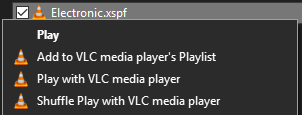

# vlc-true-shuffle

Adds a new context menu option to ".xspf" files that creates a new (temporary) shuffled playlist and then plays it.

## Why?
When going to the next track, VLC media player's shuffle currently just chooses a random song from the entire playlist. This makes it so if you have really long playlists, you may get repeats before hearing all of the songs.

## Prerequisites

1. VLC media player (duh)
2. [Node.js](https://nodejs.org/en/)

## Install

1. Make a folder containing `shuffle.bat` and `shuffle.js` (wherever you'd like).
2. Run `shuffle.bat`. A prompt will open asking you if you want to allow your registry to be edited. (This is to add in the context menu button)
3. Shuffle play is now ready to use. You may have to restart Windows Explorer, sign out and sign back in, or restart your computer.

## Uninstall

Run `uninstall.reg` to remove the context menu entry. You can then safely delete the files.
